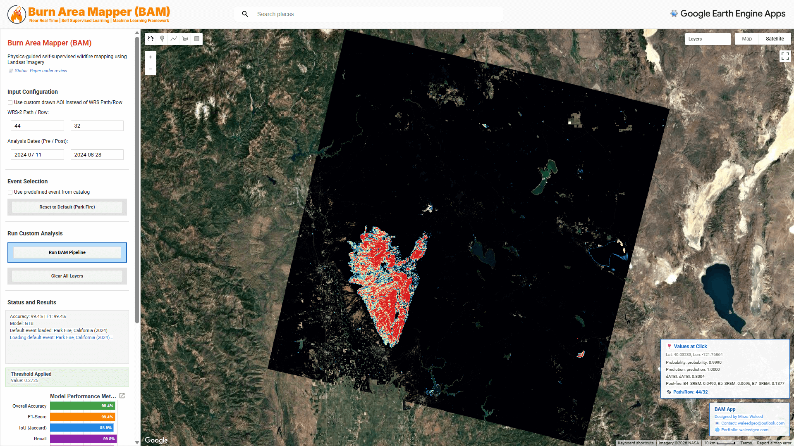

<div align="center">
  <a href="http://bam.waleedgeo.com">
    
  </a>

  <h1 align="center">Burn Area Mapper (BAM)</h1>
  <p align="center">
    <strong>An Automated, Self-Supervised Machine Learning Framework for Near-Real-Time Wildfire Burned Area Mapping using Multi-Source Earth Observation</strong>
    <br />
    <br />
    <a href="http://bam.waleedgeo.com"><strong>Launch GEE App »</strong></a>
    <br />
    <br />
    <a href="#-overview">Overview</a>
    ·
    <a href="#-interactive-gee-app">BAM App</a>
    ·
    <a href="#-key-features">Features</a>
    ·
    <a href="#-repository-structure">Code Access</a>
    ·
    <a href="#-citation">Citation</a>
    ·
    <a href="#author--contact">Contact</a>
  </p>

  <p align="center">
    
    
    <a href="https://creativecommons.org/licenses/by-nc-sa/4.0/">
      
    </a>
  </p>
</div>

<br />

## 📖 Overview

**BAM (Burn Area Mapper)** represents a paradigm shift in Earth observation for disaster management, moving from historical post-fire assessments to highly automated, near-real-time wildfire burned area mapping. By leveraging multi-source Earth Observation (EO) data within the Google Earth Engine (GEE) environment, BAM provides a scalable, self-supervised machine learning framework that operates without the need for extensive manual data annotation.

The framework integrates advanced atmospheric correction models (SREM) and state-of-the-art spectral indices with Gradient Tree Boosting algorithms. Through intelligent weak labeling driven by dynamic Otsu thresholding, BAM automates the generation of training data, achieving robust cross-validated classification accuracy across diverse biomes globally.

> **📢 Project Status**
>
> The manuscript describing this methodology is currently **under review** at the *Remote Sensing of Environment* journal. The full dataset processing pipeline and source code will be made publicly available immediately following manuscript acceptance.

> 📧 For early access to the codebase for validation or research purposes, please [contact the author](#author--contact).

---

## 🌍 Interactive GEE App

Visualize and interact with the BAM framework directly through our Google Earth Engine web application. The platform provides global coverage for monitoring recent and historical wildfire events using Landsat 8/9 imagery.

<div align="center">
  <a href="http://bam.waleedgeo.com">
    
  </a>
</div>

> Click the image above to launch the BAM Web App.

---

## ✨ Key Features

### Methodology & Technical Excellence
* 🤖 **Self-Supervised Machine Learning:** Automated integration of Gradient Tree Boosting models trained on robust weak labels, eliminating the manual annotation bottleneck.
* 🛰️ **Multi-Source Earth Observation:** Harnesses the power of Landsat 8/9 data with advanced spectral indices designed specifically for vegetation burn severity.
* 🔬 **Embedded Atmospheric Correction:** Features built-in SREM (Simplified Robust Elevation Model) surface reflectance estimation for consistent multi-temporal analyses globally.
* 📊 **Automated Weak Labeling:** Employs dynamic Otsu-based thresholding for intelligent, biome-adaptive training label generation.

### Scale & Accessibility
* 🌍 **Global Operability:** Designed and validated to function seamlessly across distinct fire regimes and disparate ecosystems worldwide.
* ⚡ **High Performance Deployment:** Built natively on Google Earth Engine for planetary-scale computation and rapid inference.

---

## 📂 Repository Structure

This repository serves as the official code and documentation hub for the BAM framework.

```text
BAM/
├── main_pipeline.py     # Orchestrates the end-to-end mapping pipeline
├── config.py            # Global configuration and hyperparameter settings
├── events.py            # Definitions and extents for validated fire events
├── modules/             # Core Python modules
│   ├── srem.py          # Atmospheric correction routines
│   ├── indices.py       # Computation of specialized spectral indices
│   ├── features.py      # Feature engineering and stack generation
│   ├── labeling.py      # Automated weak label generation algorithms
│   ├── ml.py            # Machine learning classification logic
│   └── visualization.py # Tools for rendering and exporting maps
├── notebooks/           # Jupyter notebooks for development and production
│   ├── BAM_Production.ipynb
│   └── Research_Lab.ipynb
├── gee_app/             # Google Earth Engine App deployment package
└── README.md            # Project documentation (this file)
```

> **Note:** The underlying source code components in the `modules/` and `notebooks/` directories are presently maintained in an unpublished state to adhere to academic embargo policies prior to acceptance. 

---

## 🗺️ Roadmap & Development Status

| Feature | Status | Timeline |
|---------|--------|----------|
| **BAM Web App** | ✅ Live | Available Now |
| **Manuscript Publication** | 📝 Under Review | Submitted to *Remote Sensing of Environment* |
| **Source Code Release** | 🔒 Restricted | Opens upon acceptance |
| **Dataset & Code Repository Publication** | 🔜 Pending | Release upon acceptance |

---

## 📖 Citation

If you use the BAM framework or Web App in your research, please cite the foundational manuscript once published:

```bibtex
@article{waleed2026bam,
  title={BAM: An Automated, Self-Supervised Machine Learning Framework for Near-Real-Time Wildfire Burned Area Mapping using Multi-Source Earth Observation},
  author={Waleed, Mirza and Bilal, Muhammad},
  journal={Under Review at Remote Sensing of Environment},
  year={2026}
}
```

---

## Author & Contact

**Mirza Waleed** (Main and First Author)  
*Department of Geography, Hong Kong Baptist University*  
*Hong Kong Special Administration Region of China*  

* **Website:** [waleedgeo.com](https://waleedgeo.com)
* **Email:** [waleedgeo@outlook.com](mailto:waleedgeo@outlook.com)
* **GitHub:** [@waleedgeo](https://github.com/waleedgeo)

**Co-Author:** Muhammad Bilal ([muhammad.bilal@kfupm.edu.sa](mailto:muhammad.bilal@kfupm.edu.sa))

---

## 🙏 Acknowledgments

This research incorporates large-scale geospatial processing supported by the **Google Earth Engine** platform, alongside freely accessible Multi-Source Earth Observation imagery (Landsat 8/9). We sincerely thank the reviewers and the open science community for contributing robust datasets and feedback.

---

## 📄 License

This work is licensed under a <a rel="license" href="http://creativecommons.org/licenses/by-nc-sa/4.0/">Creative Commons Attribution-NonCommercial-ShareAlike 4.0 International License</a>.

<div align="left">
<a rel="license" href="http://creativecommons.org/licenses/by-nc-sa/4.0/">

</a>
</div>

Under this license, you are free to share and adapt the material, provided you give appropriate credit, do not use it for commercial purposes, and distribute any derivative works under the same license. For full license details, please visit the <a href="https://creativecommons.org/licenses/by-nc-sa/4.0/">Creative Commons website</a>.