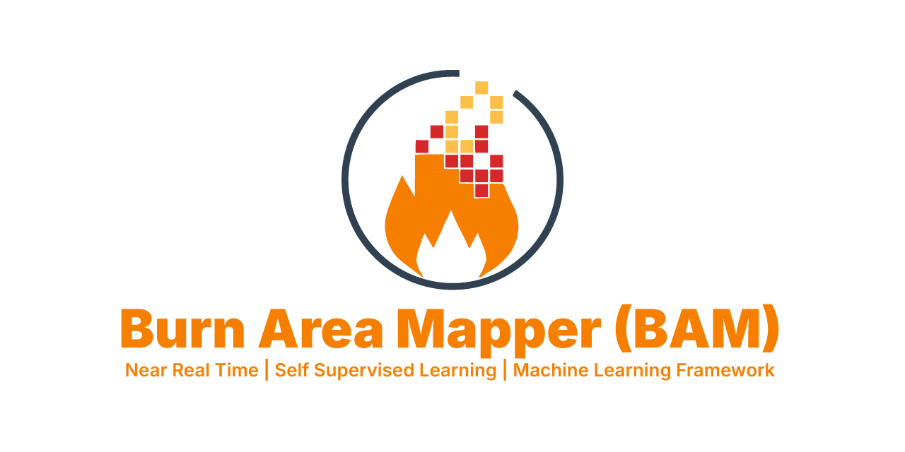

<div align="center">
  <a href="http://bam.waleedgeo.com">
    
  </a>

  <p align="center">
    <strong>BAM: A physics-informed self-supervised framework for near-real-time wildfire burned area mapping from multi-source earth observation</strong>
    <br />
    <br />
    <a href="http://bam.waleedgeo.com"><strong>Launch GEE Dashboard App »</strong></a>
    <br />
    <br />
    <a href="#overview">Overview</a>
    ·
    <a href="#interactive-gee-app">BAM App</a>
    ·
    <a href="#key-features">Features</a>
    ·
    <a href="#repository-structure">Code Access</a>
    ·
    <a href="#citation">Citation</a>
    ·
    <a href="#author--contact">Contact</a>
  </p>

  <p align="center">
    <a href="https://doi.org/10.1016/j.jag.2026.105517">
      
    </a>
    
    <a href="https://creativecommons.org/licenses/by-nc-sa/4.0/">
      
    </a>
  </p>
</div>

<br />

## Overview

**BAM (Burn Area Mapper)** represents a paradigm shift in Earth observation for disaster management, moving from historical post-fire assessments to highly automated, near-real-time wildfire burned area mapping[cite: 1]. By leveraging multi-source Earth Observation (EO) data within the Google Earth Engine (GEE) environment, BAM provides a scalable, physics-informed self-supervised machine learning framework that operates without the need for manual data annotation.

The framework integrates advanced atmospheric correction models (SREM) with Gradient Tree Boosting (GTB) algorithms. Through the novel Automated Temporal Burn Index (ATBI), BAM enforces a strict bimodal distribution to isolate high-confidence burn signals via an adaptive Otsu algorithm, automatically generating scene-specific training labels. 

> **Project Status: Published**
>
> The manuscript detailing this methodology is now published in the *International Journal of Applied Earth Observation and Geoinformation*[cite: 1]. You can access the full paper via its DOI: [10.1016/j.jag.2026.105517](https://doi.org/10.1016/j.jag.2026.105517). 
>
> **Note on Code Access:** For now, the **GEE Dashboard App** acts as the primary interface for utilizing BAM. **Stage 2 of this project** will include publishing BAM as a standalone Python package for quick installation and programmatic usage (work in progress, update coming soon!).

---

## Interactive GEE App

Visualize and interact with the BAM framework directly through our Google Earth Engine web application[cite: 1]. The platform provides global coverage for monitoring recent and historical wildfire events using Landsat 8/9 imagery[cite: 1].

<div align="center">
  <a href="http://bam.waleedgeo.com">
    
  </a>
</div>

> Click the image above to launch the BAM Web App.

---

## Key Features

### 🛠️ Methodology & Technical Excellence
* **🤖 Physics-Informed Self-Supervision:** Automated integration of Gradient Tree Boosting models trained on physics-derived pseudo-labels, eliminating the manual annotation bottleneck[cite: 1].
* **🛰️ Multi-Source Earth Observation:** Harnesses the power of Landsat 8/9 TOA data combined with specialized spectral, textural (GLCM), and topographic (FABDEM) features[cite: 1].
* **☁️ Embedded Atmospheric Correction:** Features built-in SREM (Simplified Robust Surface Reflectance Estimation Method) for consistent, latency-free multi-temporal analyses globally[cite: 1].
* **🏷️ Automated Labeling via ATBI:** Employs the novel Automated Temporal Burn Index (ATBI) and dynamic Otsu-based thresholding for intelligent, biome-adaptive training label generation[cite: 1].

### 🌎 Scale & Accessibility
* **🌐 Global Operability:** Validated across 15 wildfire events on 6 continents, achieving a global mean F1-score of 0.994 without regional retraining[cite: 1].
* **⚡ High-Resolution Detail:** Captures up to 93% more burned area in fragmented landscapes compared to MODIS MCD64A1, and effectively proxies sub-pixel burn fraction at a 30m resolution[cite: 1].
* **🚀 High-Performance Deployment:** Built natively on Google Earth Engine for planetary-scale computation and rapid inference[cite: 1].

---

## Repository Structure (Work in Progress)

This repository serves as the official code and documentation hub for the BAM framework.

```text
BAM/
├── main_pipeline.py     # Orchestrates the end-to-end mapping pipeline
├── config.py            # Global configuration and hyperparameter settings
├── events.py            # Definitions and extents for validated fire events
├── modules/             # Core Python modules
│   ├── srem.py          # Atmospheric correction routines
│   ├── indices.py       # Computation of specialized spectral indices (including ATBI)
│   ├── features.py      # Feature engineering and stack generation
│   ├── labeling.py      # Automated pseudo-label generation algorithms
│   ├── ml.py            # Gradient Tree Boosting classification logic
│   └── visualization.py # Tools for rendering and exporting maps
├── notebooks/           # Jupyter notebooks for development and production
│   ├── BAM_Production.ipynb
│   └── Research_Lab.ipynb
├── gee_app/             # Google Earth Engine App deployment package
└── README.md            # Project documentation (this file)

```

> **Note:** We are currently preparing the `modules/` and `notebooks/` components to be released as an easily installable Python package. Stay tuned for updates!

---

## Roadmap & Development Status

| Feature | Status | Timeline |
| --- | --- | --- |
| **Manuscript Publication** | Published | [DOI: 10.1016/j.jag.2026.105517](https://doi.org/10.1016/j.jag.2026.105517) |
| **BAM Web App** | Live | Available Now |
| **Stage 2: Python Package** | Work in Progress | Update Soon |
| **Source Code Release** | Rolling Out | Post-Publication Phase |

---

## Citation

If you use the BAM framework or Web App in your research, please cite our published manuscript:

```bibtex
@article{waleed2026bam,
  title={BAM: A physics-informed self-supervised framework for near-real-time wildfire burned area mapping from multi-source earth observation},
  author={Waleed, Mirza and Bilal, Muhammad},
  journal={International Journal of Applied Earth Observation and Geoinformation},
  volume={153},
  pages={105517},
  year={2026},
  publisher={Elsevier},
  doi={10.1016/j.jag.2026.105517}
}

```

---

## Author & Contact

**Mirza Waleed** (First Author & Developer)

*Department of Geography, Hong Kong Baptist University*

*Hong Kong Special Administration Region of China*

* **Website:** [waleedgeo.com](https://waleedgeo.com)
* **Email:** [waleedgeo@outlook.com](https://www.google.com/search?q=mailto%3Awaleedgeo%40outlook.com)
* **GitHub:** [@waleedgeo](https://github.com/waleedgeo)

**Muhammad Bilal** (Second & Corresponding Author)

*Architecture and City Design Department, College of Design and Built Environment, King Fahd University of Petroleum & Minerals, Dhahran, Saudi Arabia*

*Center for Aviation & Space Exploration, King Fahd University of Petroleum & Minerals, Dhahran, Saudi Arabia*

* **Email:** [muhammad.bilal@kfupm.edu.sa](https://www.google.com/search?q=mailto%3Amuhammad.bilal%40kfupm.edu.sa)

---

## Acknowledgments

The authors express their sincere gratitude to the **United States Geological Survey (USGS)** and the **European Space Agency (ESA)** for providing the Landsat 8/9 and Sentinel-2 imagery. We are deeply thankful to the **Google Earth Engine** team for providing the high-performance cloud computing infrastructure essential for this planetary-scale analysis.

We also thank the **Deanship of Research at King Fahd University of Petroleum and Minerals** for funding support, and **Prof. Yizhou Zhuang** for constructive suggestions on the study design. We acknowledge the open-access contributions of the **FABDEM** and **WorldCover** projects, which provided critical baseline datasets.

---

## License

This work is licensed under a Creative Commons Attribution-NonCommercial-ShareAlike 4.0 International License.

Under this license, you are free to share and adapt the material, provided you give appropriate credit, do not use it for commercial purposes, and distribute any derivative works under the same license. For full license details, please visit the Creative Commons website.
